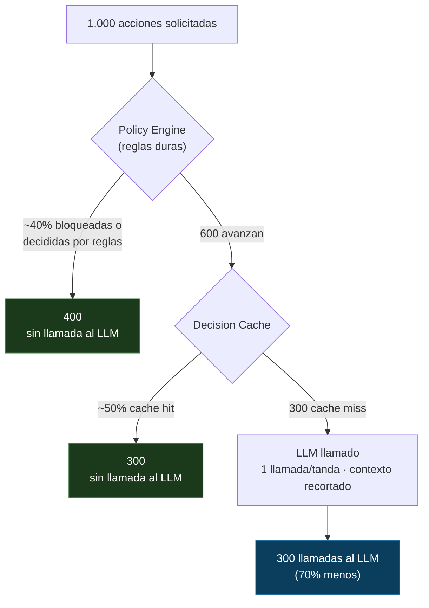

# Safe Automation Control Plane (SACP)

[English](README.md) · **Español**

**Dejá que la IA ejecute acciones reales — sin darle la última palabra.**

SACP es un patrón de arquitectura agnóstico al lenguaje para cualquier producto
donde un LLM decide acciones que cuestan plata, pegan a APIs externas o tienen
riesgo operativo: plataformas de mensajería, CRMs, marketplaces, herramientas de
marketing, copilotos internos, agentes autónomos.

La idea en una línea:

```
La IA propone.
Las reglas duras deciden qué está permitido.
Los validadores deciden qué puede ejecutarse.
Los executors solo corren decisiones validadas.
```

La mayoría de los stacks de agentes conectan el modelo directo a la ejecución:

```
el usuario pide  ->  el modelo decide  ->  el sistema ejecuta
```

Eso alcanza para una demo y es peligroso en producción. En el momento en que una
acción puede cobrar una tarjeta, mandar por un canal pago, publicar contenido o
violar un límite de plan, "lo decidió el modelo" no es un registro de auditoría
aceptable.

SACP invierte el control: **el modelo nunca tiene autoridad**. Optimiza dentro de
una caja que las reglas determinísticas le dibujan, y cada decisión se valida,
cachea, costea y audita antes de que algo se ejecute.

---

## Por qué se adopta

- **Menos gasto de LLM.** El motor no llama al modelo cuando una regla, un cache
  hit o una tool determinística ya resuelven el caso. Una llamada por tanda, no
  una por destinatario. Contexto recortado (sin texto crudo del usuario, sin
  secretos).
- **Menos gasto de APIs externas.** El costo se estima antes de ejecutar, se
  reserva saldo, las llamadas duplicadas se atrapan por idempotencia, a los
  proveedores caídos no se les insiste.
- **Sin acciones descontroladas.** Las reglas duras corren *antes* del modelo.
  Un business validator puede convertir el `allow` del modelo en `block` después.
  El modelo no puede pasar por encima de límites de plan, opt-out, falta de
  saldo o un canal desconectado.
- **Auditable por diseño.** Cada decisión se persiste con sus inputs, el modelo
  usado, el costo en tokens, el nivel de riesgo y las reglas aplicadas.
- **Canales y dominios nuevos sin tocar el core.** El motor es agnóstico al
  canal y a la acción. Agregar un proveedor es agregar un manifest; agregar un
  dominio es agregar un context builder.

> Nota sobre "ahorro de tokens": solo el **Decision Engine** reduce tokens de LLM
> de verdad (reglas-primero + cache de decisiones + contexto recortado). El Model
> Layer reduce *costo* eligiendo el modelo más barato suficiente, y el Outbound
> Gateway ahorra plata de *APIs externas* — no tokens de LLM. SACP es una capa de
> control de costos y gobierno; la reducción de tokens es uno de sus efectos, no
> toda la historia.

### A dónde van los tokens (ilustrativo)

Las reglas y un cache de decisiones se ubican *delante* del modelo, así que la
mayor parte del tráfico se decide antes de gastar un solo token:



En un ejemplo por-request eso da **~86% menos tokens**; para acciones de fan-out
(una decisión por campaña en vez de una llamada por destinatario) se acerca al
~99%. Son un modelo ilustrativo con una fórmula donde enchufás tus propias tasas
— ver **[docs/token-savings.md](docs/token-savings.md)**, que además muestra cómo
medir el número real con las métricas de uso ya incluidas.

---

## Los tres componentes

```
Acción solicitada (UI, bot, asistente interno, worker, webhook entrante)
   |
   v
[ Context Builder ]  arma un RoutingSnapshot universal con un action.type
   |
   v
======================  DECISION ENGINE  ======================
 Policy Engine        reglas duras — bloquea antes de llamar al modelo
 Decision Cache       mismo input + contexto? reusa, no llama al modelo
 Provider Selector    elige modelo por feature / riesgo / plan / costo    --.
 AI Router            el ÚNICO componente que llama al LLM                  | MODEL
 Schema Validator     rechaza output malformado, reintenta una vez         | LAYER
 Business Validator   re-chequea reglas duras contra el output del modelo --'
 Approval Workflow    crea un pedido de aprobación si el riesgo lo exige
 Rule-Only Fallback   decisión conservadora si el modelo falla / no aporta
===============================================================
   |
   v
 Executor             corre SOLO una decisión validada y aún vigente
   |
   v
======================  OUTBOUND GATEWAY  =====================
 Provider Registry    manifest declarativo por proveedor externo
 Token Refresh        token válido con un lease anti-concurrencia
 Idempotency          nunca ejecutar la misma acción dos veces
 Circuit Breaker      dejar de insistirle a un endpoint caído
 Rate Limit           por tenant + proveedor
 Retry / Backoff      definido por el manifest, no por el caller
 Attempt Log + Cost   cada llamada queda medida y auditable
===============================================================
   |
   v
 API externa
```

| Componente | Qué hace | Leer |
|---|---|---|
| **Decision Engine** | Convierte cualquier acción en una decisión validada y auditada. Reglas primero, IA segundo, validadores al final. | [docs/01-decision-engine.md](docs/01-decision-engine.md) |
| **AI Model Layer** | El único lugar donde vive el LLM: selección de modelo, cache, medición de uso, circuit breaker, validación de schema, defensa contra prompt injection. | [docs/02-model-layer.md](docs/02-model-layer.md) |
| **Outbound Gateway** | Una sola puerta controlada para toda llamada a API externa: tokens, idempotencia, reintentos, breaker, rate limit, cost ledger. | [docs/03-outbound-gateway.md](docs/03-outbound-gateway.md) |

Las piezas son independientes. Podés adoptar solo el Outbound Gateway, solo el
Decision Engine, o los tres. Se componen, no dependen una de otra para existir.

---

## Para quién es

- Tenés un producto donde un LLM elige acciones con costo, efectos secundarios o
  peso de compliance.
- Querés la utilidad del modelo sin entregarle tu billetera, tu reputación, ni
  tus sentencias `DELETE`.
- Necesitás explicar, después del hecho, *por qué* una acción se ejecutó o se
  bloqueó.

Si tu LLM solo genera texto que lee un humano, no necesitás esto. Si *hace*
cosas, sí.

---

## Estado y filosofía

Esto es un **patrón y un spec**, no un framework que instalás con `npm`. Es
deliberadamente agnóstico al lenguaje y a la base de datos — importan los
contratos, no el motor de storage. Fue extraído de un sistema en producción, por
eso existe [docs/lessons-learned.md](docs/lessons-learned.md): esos son bugs
reales encontrados corriendo el patrón, no leyendo sobre él. Empezá ahí si querés
saber si quien escribió esto realmente lo construyó.

Orden de lectura recomendado:

1. [docs/01-decision-engine.md](docs/01-decision-engine.md) — el corazón.
2. [docs/02-model-layer.md](docs/02-model-layer.md) — cómo se encajona la IA.
3. [docs/03-outbound-gateway.md](docs/03-outbound-gateway.md) — cómo las acciones llegan al mundo.
4. [docs/lessons-learned.md](docs/lessons-learned.md) — qué se rompe en la práctica.

---

## Licencia

MIT — ver [LICENSE](LICENSE). Usalo, forkealo, publicalo. La atribución se
agradece, no se exige.
