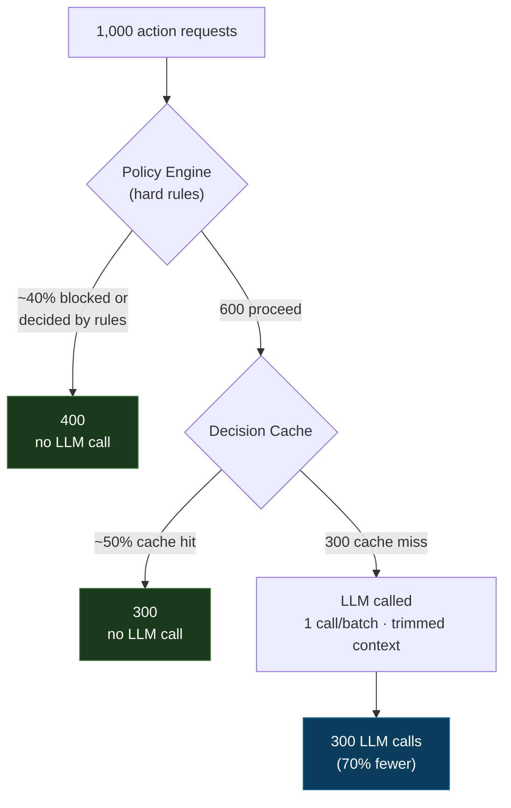

# Safe Automation Control Plane (SACP)

**English** · [Español](README.es.md)

[](https://github.com/cristiandkzk/SACP/actions/workflows/ci.yml)
[](https://www.npmjs.com/package/sacp-core)

**Let AI take real-world actions — without giving it the last word.**

SACP is a language-agnostic architecture pattern for any product where an LLM
decides actions that cost money, hit external APIs, or carry operational risk:
messaging platforms, CRMs, marketplaces, marketing tools, internal copilots,
autonomous agents.

The idea in one line:

```
The AI proposes.
Hard rules decide what is allowed.
Validators decide what may execute.
Executors only run validated decisions.
```

Most agent stacks wire the model straight to tool execution:

```
user asks  ->  model decides  ->  system executes
```

That is fine for a demo and dangerous in production. The moment an action can
charge a card, message a paying channel, publish content, or breach a plan
limit, "the model decided" is not an acceptable audit trail.

SACP inverts the control: **the model never has authority**. It optimizes
inside a box that deterministic rules draw for it, and every decision is
validated, cached, costed, and audited before anything runs.

---

## Why people adopt this

- **Lower LLM spend.** The engine does not call the model when a rule, a cache
  hit, or a deterministic tool already resolves the case. One call per batch
  instead of one per recipient. Trimmed context (no raw user text, no secrets).
- **Lower external-API spend.** Cost is estimated before executing, balance is
  reserved, duplicate calls are caught by idempotency, dead providers are not
  hammered.
- **No rogue actions.** Hard rules run *before* the model. A business validator
  can turn the model's `allow` into `block` after the fact. The model cannot
  override plan limits, opt-out, missing balance, or a disconnected channel.
- **Auditable by construction.** Every decision is persisted with its inputs,
  the model used, token cost, risk level, and the rules applied.
- **New channels and domains without touching the core.** The engine is
  channel-agnostic and action-agnostic. Adding a provider is adding a manifest;
  adding a domain is adding a context builder.

> Note on "token saving": only the **Decision Engine** truly reduces LLM tokens
> (rules-first + decision cache + trimmed context). The Model Layer reduces
> *cost* by picking the cheapest sufficient model, and the Outbound Gateway
> saves money on *external API* calls — not LLM tokens. SACP is a cost-control
> and governance layer; token reduction is one of its effects, not the whole
> story.

### Where the tokens go (illustrative)

Rules and a decision cache sit *in front of* the model, so most traffic is
decided before a single token is spent:



In a per-request example that works out to **~86% fewer tokens**; for fan-out
actions (one decision per campaign instead of one call per recipient) it
approaches ~99%. These are an illustrative model with a formula you can plug your
own rates into — see **[docs/token-savings.md](docs/token-savings.md)**, which
also shows how to measure the real number from the built-in usage metrics.

---

## The three components

```
Action requested (UI, bot, internal assistant, worker, inbound webhook)
   |
   v
[ Context Builder ]  builds a universal RoutingSnapshot with an action.type
   |
   v
======================  DECISION ENGINE  ======================
 Policy Engine        hard rules — block before any model call
 Decision Cache       same input + context? reuse, don't call the model
 Provider Selector    pick model by feature / risk / plan / cost      --.
 AI Router            the ONLY component that calls the LLM             | MODEL
 Schema Validator     reject malformed output, retry once, then fall back| LAYER
 Business Validator   re-check hard rules against the model's output   --'
 Approval Workflow    create an approval request when risk requires it
 Rule-Only Fallback   conservative decision when the model fails/adds no value
===============================================================
   |
   v
 Executor             runs ONLY a still-valid, validated decision
   |
   v
======================  OUTBOUND GATEWAY  =====================
 Provider Registry    declarative manifest per external provider
 Token Refresh        valid token with an anti-concurrency lease
 Idempotency          never run the same action twice
 Circuit Breaker      stop hammering a failing endpoint
 Rate Limit           per tenant + provider
 Retry / Backoff      defined by the manifest, not the caller
 Attempt Log + Cost   every call is measured and auditable
===============================================================
   |
   v
 External API
```

| Component | What it does | Read |
|---|---|---|
| **Decision Engine** | Turns any action into a validated, audited decision. Rules first, AI second, validators last. | [docs/01-decision-engine.md](docs/01-decision-engine.md) |
| **AI Model Layer** | The only place the LLM lives: model selection, caching, usage metering, circuit breaking, schema validation, prompt-injection defense. | [docs/02-model-layer.md](docs/02-model-layer.md) |
| **Outbound Gateway** | One controlled door for every external API call: tokens, idempotency, retries, breaker, rate limit, cost ledger. | [docs/03-outbound-gateway.md](docs/03-outbound-gateway.md) |

The pieces are independent. You can adopt the Outbound Gateway alone, the
Decision Engine alone, or all three. They compose, they don't depend on each
other to exist.

---

## Install (reference core)

The deterministic, hard-to-get-right pieces ship as a small **zero-dependency
TypeScript package**, [`sacp-core`](packages/core) — a policy engine, strict
decision-output validation, rule-only fallback, decision state machine, circuit
breaker and rate limiter, plus the ports you implement (storage, LLM provider,
business validator).

```bash
npm install sacp-core
```

```ts
import { DecisionEngine, PolicyEngine } from 'sacp-core';

const policy = new PolicyEngine();
policy.register('router_ai.campaign_send', (snap) => {
  const ctx = snap.context as { balance: number; cost: number };
  return ctx.balance >= ctx.cost
    ? { allowed: true }
    : { allowed: false, reasonCode: 'BALANCE_INSUFFICIENT' };
});

// No model wired yet -> a conservative rule-only decision, never an exception.
const engine = new DecisionEngine({ policy });
const { output } = await engine.decide({
  tenantId: 't_123',
  action: { type: 'campaign_send' },
  risk: { riskLevel: 'low' },
  context: { balance: 1000, cost: 200 },
});
// output.decision -> 'allow' | 'block' | 'require_approval' | 'split'
```

Full package docs and the LLM-adapter example: **[packages/core](packages/core)**.
The core ships the logic and the contracts; your database and model provider stay
yours — that is what keeps it dependency-free.

---

## Who this is for

- You ship a product where an LLM picks actions with cost, side effects, or
  compliance weight.
- You want the model's usefulness without handing it your wallet, your
  reputation, or your `DELETE` statements.
- You need to explain, after the fact, *why* a given action ran or was blocked.

If your LLM only generates text that a human reads, you do not need this. If it
*does* things, you do.

---

## Status & philosophy

This is primarily a **pattern and a spec**. A small reference core
([`sacp-core`](packages/core)) implements the deterministic pieces so you can
`npm install` the part that is genuinely hard to get right — but the spec is the
primary artifact, and the core is deliberately language- and database-agnostic:
the contracts matter, the storage engine does not. It was extracted from a production system, which is why
[docs/lessons-learned.md](docs/lessons-learned.md) exists: those are real bugs
found by running the pattern, not by reading about it. Start there if you want
to know whether the people who wrote this actually built it.

Recommended reading order:

1. [docs/01-decision-engine.md](docs/01-decision-engine.md) — the heart of it.
2. [docs/02-model-layer.md](docs/02-model-layer.md) — how the AI is boxed in.
3. [docs/03-outbound-gateway.md](docs/03-outbound-gateway.md) — how actions reach the world.
4. [docs/lessons-learned.md](docs/lessons-learned.md) — what breaks in practice.

---

## License

MIT — see [LICENSE](LICENSE). Use it, fork it, ship it. Attribution appreciated,
not required.
