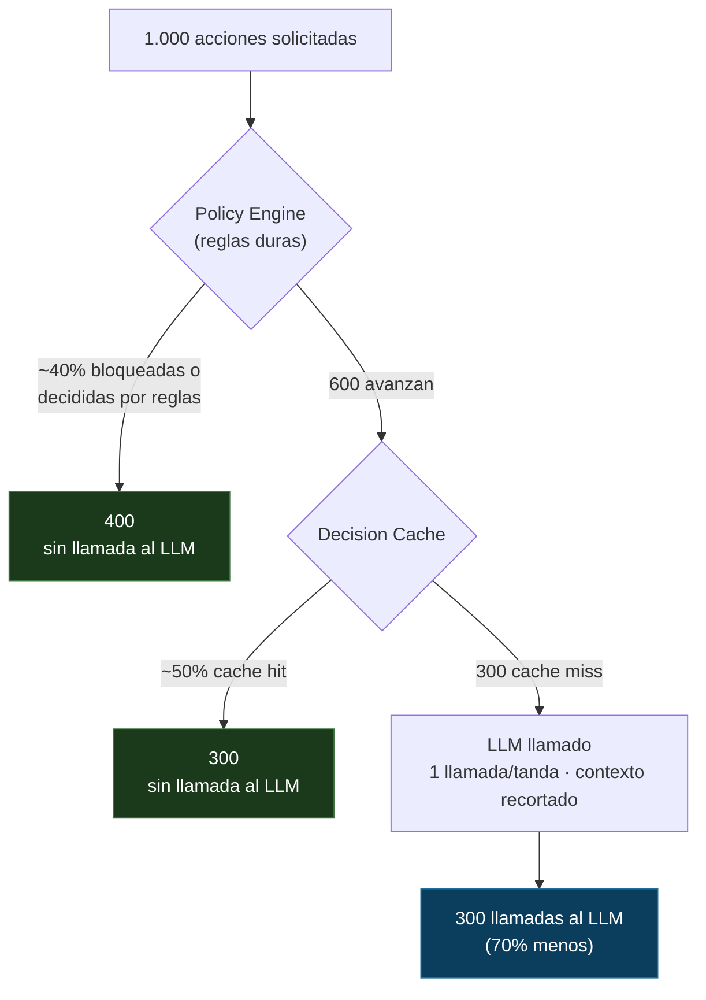

# Cómo ahorra tokens

[English](token-savings.md) · [Español](token-savings.es.md)

Esta página hace concreto el reclamo de costo. Los números de abajo son un
**modelo ilustrativo, no un benchmark medido** — el punto es mostrar *de dónde*
vienen los ahorros y darte una fórmula donde enchufar tus propias tasas. El
control plane ya mide los números reales por vos (ver "Medí el tuyo", última
sección).

Solo el **Decision Engine** reduce tokens de LLM. Lo hace en cuatro lugares, en
el orden en que viaja un request:

```
1. Deflexión por reglas    — una regla / cache / tool resuelve, sin llamada al LLM
2. Cache de decisiones     — mismo input + contexto reusa la última decisión
3. Una llamada por tanda   — una llamada al LLM por campaña, no una por destinatario
4. Contexto recortado      — sin texto crudo del usuario, sin secretos, sin historial entero
```

## El embudo: la mayoría de los requests nunca llegan al modelo



Los porcentajes exactos dependen de tu dominio. La forma no: las reglas y el cache
se ubican *delante* del modelo, así que una fracción grande del tráfico se decide
antes de gastar un solo token.

## Ejemplo trabajado: acciones por-request

Tomá 1.000 acciones (ej. respuestas inbound). Comparemos un enfoque ingenuo de
"llamar al modelo siempre, con contexto completo" contra SACP.

| | Ingenuo | SACP |
|---|---|---|
| Requests | 1.000 | 1.000 |
| Deflectados por reglas | 0 | ~400 |
| Servidos desde cache | 0 | ~300 |
| **Llamadas al LLM** | **1.000** | **300** |
| Tokens de input / llamada | 2.000 (snapshot completo + texto crudo) | 800 (recortado, sin texto crudo) |
| Tokens de output / llamada | 300 | 300 |
| Tokens / llamada | 2.300 | 1.100 |
| **Tokens totales** | **2.300.000** | **330.000** |

Resultado: **~86% menos tokens** — y dos tercios de eso viene de *no llamar al
modelo en absoluto*, no de un prompt más chico.

## Ejemplo trabajado: acciones de fan-out (el dramático)

Algunas acciones tocan muchos destinatarios — una campaña, un broadcast. El
instinto ingenuo es una llamada al modelo por destinatario. El motor hace **una
decisión por tanda**.

| | Ingenuo (por destinatario) | SACP (por tanda) |
|---|---|---|
| Tamaño de campaña | 5.000 destinatarios | 5.000 destinatarios |
| Llamadas al LLM | 5.000 | 1 |
| Tokens / llamada | 2.300 | 1.400 (resumen de la tanda) |
| **Tokens totales** | **11.500.000** | **1.400** |

Acá el ahorro no es 86% — es ~99,99%, porque el trabajo del modelo es decidir
*tandas/delays/riesgo de la campaña*, que es una decisión, no cinco mil.

## Calculá el tuyo

```
tokens_ingenuo = N × llamadas_por_accion × (in_full + out)

tokens_sacp    = N × (1 − r_rules) × (1 − r_cache) × (in_trimmed + out)
```

| Símbolo | Significado | De dónde sacarlo |
|---|---|---|
| `N` | cantidad de acciones | tu tráfico |
| `llamadas_por_accion` | llamadas al LLM por acción en la versión ingenua (1 para respuestas, cantidad de destinatarios para fan-out) | tu código actual |
| `r_rules` | fracción resuelta por reglas duras / tools | `ai_decision_rule_only_total / requests` |
| `r_cache` | fracción de cache-hit de lo que llega al cache | `ai_decision_cache_hits_total / (requests − rule_only)` |
| `in_full`, `in_trimmed` | tokens de input con contexto completo vs recortado | contador de tokens sobre el snapshot |
| `out` | tokens de output por llamada | usage del modelo |

Dos palancas dominan: **`llamadas_por_accion`** (colapsar el fan-out a una
decisión) y **`r_rules` + `r_cache`** (decidir antes del modelo). El término del
contexto recortado es real pero secundario — no lo sobrevendas.

## Medí el tuyo (no confíes en la tabla de arriba)

El Usage Ledger del Model Layer y las métricas de
[02-model-layer.md](02-model-layer.md) ya exponen todo lo que necesitás para
reemplazar estos números ilustrativos por reales:

```
ai_requests_total{feature, status}     -> cuántas llamadas pasaron de verdad
ai_cache_hits_total{feature}           -> r_cache
ai_decision_rule_only_total            -> r_rules
ai_tokens_total{direction: input|output} -> in/out real por feature
```

Seguí `ai_tokens_total` antes y después de prender reglas + cache para una
feature. Ese delta es tu ahorro real — y es el único número que vale citar en
público.
