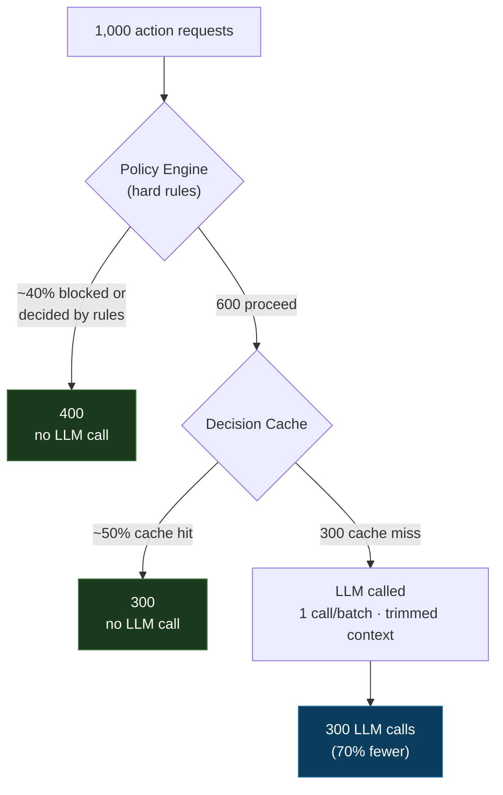

# How it saves tokens

[English](token-savings.md) · [Español](token-savings.es.md)

This page makes the cost claim concrete. The numbers below are an **illustrative
model, not a measured benchmark** — the point is to show *where* the savings
come from and give you a formula to plug your own rates into. The control plane
already meters the real numbers for you (see "Measure your own", last section).

Only the **Decision Engine** reduces LLM tokens. It does it in four places, in
the order a request travels:

```
1. Rules-first deflection   — a hard rule / cache / tool resolves it, no LLM call
2. Decision cache           — identical input + context reuses the last decision
3. One call per batch       — one LLM call per campaign, not one per recipient
4. Trimmed context          — no raw user text, no secrets, no full history
```

## The funnel: most requests never reach the model



The exact percentages depend on your domain. The shape does not: rules and cache
sit *in front of* the model, so a large fraction of traffic is decided before a
single token is spent.

## Worked example: per-request actions

Take 1,000 actions (e.g. inbound replies). Compare a naive "call the model every
time, with full context" approach against SACP.

| | Naive | SACP |
|---|---|---|
| Requests | 1,000 | 1,000 |
| Deflected by rules | 0 | ~400 |
| Served from cache | 0 | ~300 |
| **LLM calls** | **1,000** | **300** |
| Input tokens / call | 2,000 (full snapshot + raw text) | 800 (trimmed, no raw text) |
| Output tokens / call | 300 | 300 |
| Tokens / call | 2,300 | 1,100 |
| **Total tokens** | **2,300,000** | **330,000** |

Result: **~86% fewer tokens** — and two thirds of that comes from *not calling
the model at all*, not from a smaller prompt.

## Worked example: fan-out actions (the dramatic one)

Some actions touch many recipients — a campaign, a broadcast. The naive instinct
is one model call per recipient. The engine makes **one decision per batch**.

| | Naive (per recipient) | SACP (per batch) |
|---|---|---|
| Campaign size | 5,000 recipients | 5,000 recipients |
| LLM calls | 5,000 | 1 |
| Tokens / call | 2,300 | 1,400 (batch summary) |
| **Total tokens** | **11,500,000** | **1,400** |

Here the saving is not 86% — it is ~99.99%, because the model's job is to decide
*batching/delays/risk for the campaign*, which is one decision, not five thousand.

## Compute your own

```
tokens_naive = N × calls_per_action × (in_full + out)

tokens_sacp  = N × (1 − r_rules) × (1 − r_cache) × (in_trimmed + out)
```

| Symbol | Meaning | Where to get it |
|---|---|---|
| `N` | number of actions | your traffic |
| `calls_per_action` | LLM calls per action in the naive version (1 for replies, recipient count for fan-out) | your current code |
| `r_rules` | fraction resolved by hard rules / tools | `ai_decision_rule_only_total / requests` |
| `r_cache` | cache-hit fraction of what reaches the cache | `ai_decision_cache_hits_total / (requests − rule_only)` |
| `in_full`, `in_trimmed` | input tokens with full vs trimmed context | token counter on the snapshot |
| `out` | output tokens per call | model usage |

Two levers dominate: **`calls_per_action`** (collapsing fan-out to one decision)
and **`r_rules` + `r_cache`** (deciding before the model). The trimmed-context
term is real but secondary — do not oversell it.

## Measure your own (don't trust the table above)

The Model Layer's Usage Ledger and the metrics in
[02-model-layer.md](02-model-layer.md) already expose everything you need to
replace these illustrative numbers with real ones:

```
ai_requests_total{feature, status}     -> how many calls actually happened
ai_cache_hits_total{feature}           -> r_cache
ai_decision_rule_only_total            -> r_rules
ai_tokens_total{direction: input|output} -> real in/out per feature
```

Track `ai_tokens_total` before and after enabling rules + cache for one feature.
That delta is your real saving — and it is the only number worth quoting in
public.
